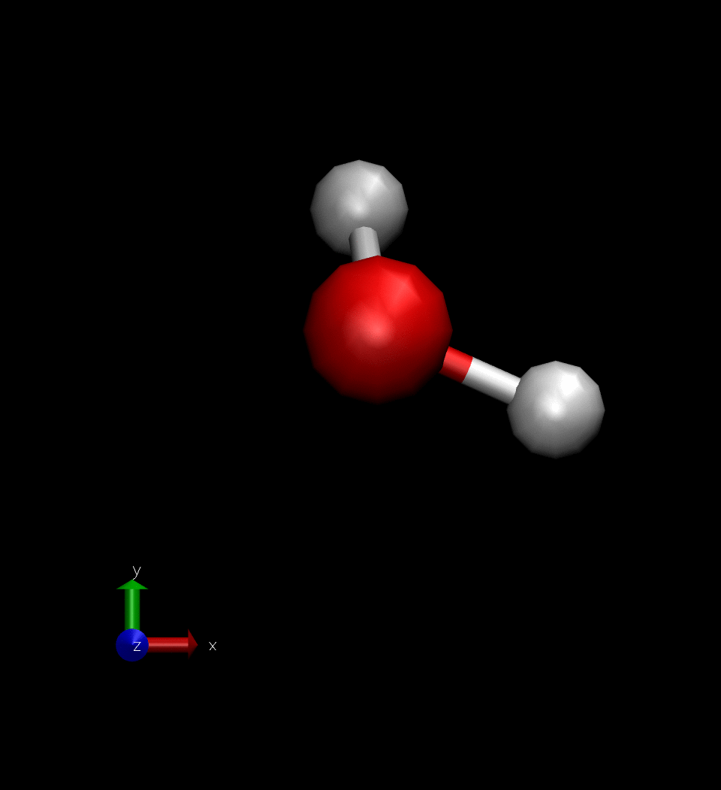
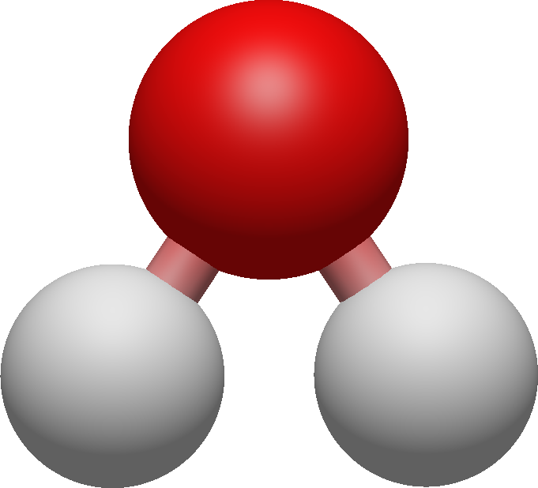

# Theoretical Background #

## Molecular Dynamics ##

Molecular Dynamics (MD) is a computer simulation technique used to study the movement of atoms and molecules, often used in the fields of theoretical chemistry and solid-state physics. It allows us to find numerical solutions to the equations of motion. Most commonly Born-Oppenheimer MD (BOMD) are applied, in which the atoms get treated via classical mechanics. For a certain geometry an approximation of the Schrödinger equation is solved, the resulting forces are applied for a short time span (the time step, often on the order of 1 fs) and the atoms moved, before beginning anew. 

Naturally only a limited number of atoms can be simulated. Putting these atoms into a vacuum or constraining them with a set of impenetrable walls would have a strong influence on the system, which would distort its properties. In order to approximate the infinitely large bulk phase, a simulation box with periodic boundary conditions is used. These boundary conditions define a parallelepiped, which contains all simulated atoms. Should an atom try to leave the simulation box, it will simply reappear on the opposite site. In effect the simulation box is repeated infinitely often in all directions.

The result of such simulations are trajectories. A trajectory is in essence a way to represent the movement of atoms (or other particles) through three-dimensional space. The most accessable visualisation of a trajectory is a video showing the movement of atoms through space. As an example a water molecule at 350 K over the course of 100 fs might look like this:

## Trajectories ##

Trajectories can be represented in a multitude of file formats. For this program I have chosen to support the .xyz file format. Trajectories of this format are for example produced by the free software packages [CP2K](https://www.cp2k.org/) and [ORCA](https://orcaforum.kofo.mpg.de/app.php/portal).

Files of the .xyz format generally follow this structue:

    number of atoms
    (comment line)
    chemical symbol      x-coordinate    y-coordinate    z-coordinate
    chemical symbol      x-coordinate    y-coordinate    z-coordinate
    chemical symbol      x-coordinate    y-coordinate    z-coordinate
    .
    .
    .

As a simple example, a water molecule could be represented as:

<table style="border: none;">
<tr>
<td>

    3
    my water molecule
    O  0.000000  0.000000  0.000000
    H  0.758602  0.000000  0.504284
    H  0.758602  0.000000 -0.504284

<td>

</table>

This shows the water molecule at some specific point in time. In order to show its evolution through time, the same syntax can be repeated with updated coordinates as often as necessary.

## Calculations ##

### Mean-square displacement ##

The mean-square displacement (MSD) is a measure of the average mobility of atoms (or any structure with a set of coordinates) over short time spans, called correlation times or lag times. The MSD for a correlation time \f$\tau\f$ is the squared distance between the coordinates before \f$\vec{r}(t)\f$ and after \f$\vec{r}(t+\tau)\f$ the correlation time, averaged over all atoms \f$i\f$ and time windows \f$t\f$ to \f$t+\tau\f$:

\f[
    MSD(\tau) = \left< \left| \vec{r}_i (t + \tau) - \vec{r}_i (t) \right| ^2 \right> _ {t, i}
\f]

All time windows are assumed to be completely uncorrelated to each other and will be used to calculate the MSD. For example for a trajectory with 100 time steps and a correlation time of 10 time steps, the MSD(10 time steps) will be the average of 90 time windows starting with 1 to 11 and ending with 90 to 100. For large correlation times, the number of time windows will thus decrease, which leads to higher statistical noise. Correlation times should therefore generally be given an upper limit much lower than the overall length of the trajectory.

From the MSD the diffusion coefficient can be calculated via:

\f[
    D = \lim_{\tau \rightarrow \infty} \frac{1}{6\tau} MSD(\tau)
\f]

Accordingly a linear fit is applied to the calculated MSD-\f$\tau\f$-values and a sixth of the slope is returned as the diffusion coefficient. In general the MSD shows good linearity only for sufficiently high correlation times, which is why the linear fit is only applied to the second half of the sampled correlation times.

### Radial-distribution function ##

The radial-distribution function (RDF) \f$g_{ab}(r)\f$ is defined as the probability of finding a particle of type b at a distance \f$r\f$ from a particle of type a relative to the uniform density, which would occur if all particles were distributed uniformly in the simulation cell:

\f[
    g_{ab}(r) = \frac{V}{N_a \cdot N_b} 
                \sum_{i=1}^{N_a} 
                \sum_{j=1}^{N_b} 
                \left< \delta
                \left( r - 
                \left| \vec{r}_i(t) - \vec{r}_j(t)
                \right|
                \right)
                \right>_t
\f]

Since a real trajectory can only give a limited sample size, the delta distribution is replaced by a binning function, which sorts the occuring distances into equidistant bins. A peak in the RDF plot might indicate the association of particles, e.g. ions due to electrostatic interaction or atoms within a molecule due to covalent bonding.

### Orientational auto-correlation function##

The orientational auto-correlation function (OACF) \f$ g_{ab} (\tau) \f$ is a measure of the rotational dynamics of a vector \f$ \vec{x}_i \f$. This vector is the connection between each atom of type a and the atom of type b closest to it, which usually represents a bond. The auto-correlation function is then:

\f[
    \vec{x}_i = \vec{r}_{a, i} - \vec{r}_{b, i}
\f]

\f[
    g(\tau) = \left< \vec{x}_i (t) \cdot \vec{x}_i (t+\tau) \right>
\f]
